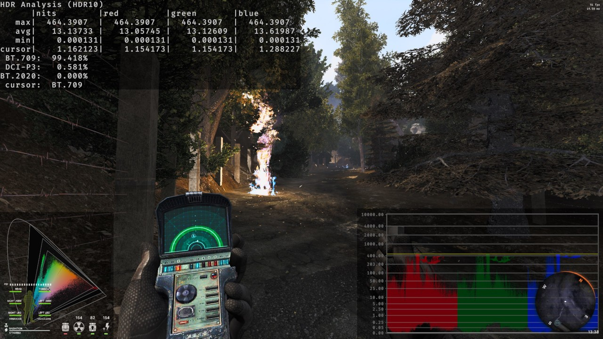

# Implementing HDR10 Output in an Existing DX11 Game Engine

I recently added HDR output to S.T.A.L.K.E.R. Anomaly, an existing SDR game in an old engine, this is just a big info dump of everything I had to do to get it working correctly. I'll try to provide sources, graphics, and diagrams where applicable for clarity. This isn't really a tutorial on HDR rendering, display, color theory, etc. but this will likely help someone in a similar position to mine, and could be a useful resource if you want to add HDR output to your renderer.

Here are all the PRs I made related to it if you want to just look at code:
* [Add HDR10 output support to the DX11 renderer](https://github.com/themrdemonized/xray-monolith/pull/63)
* [Fix HDR10 issues with HUD samplers and MSAA setting](https://github.com/themrdemonized/xray-monolith/pull/65)
* [Fix for D3D management issues in `dx10HW.cpp`](https://github.com/themrdemonized/xray-monolith/pull/66)
* [Fix HDR10 rendering](https://github.com/themrdemonized/xray-monolith/pull/71)
* [DX11 DWM vsync fix for windowed modes](https://github.com/themrdemonized/xray-monolith/pull/72)

# Background
S.T.A.L.K.E.R. Anomaly uses a modified version of GSC Game World's X-Ray engine. I believe it's based on the engine S.T.A.L.K.E.R. Call of Pripyat uses, a game released in 2009. The source code is available (I think the licensing is still in limbo, but definitely non-commerical) and there are several forks of the original X-Ray code in use by a variety of mods:
* [X-Ray Monolith](https://bitbucket.org/anomalymod/xray-monolith/src/master/)
* [Modded X-Ray Monolith](https://github.com/themrdemonized/xray-monolith)
* [OpenXRay](https://github.com/OpenXRay/xray-16)
* [OGSR](https://github.com/OGSR/OGSR-Engine)
* [IXRay](https://github.com/ixray-team/ixray-1.6-stcop)

The DX11 renderer seemed to target the original DX11 interface (i.e. pre-DXGI) and doesn't make use of any of the C++ COM wrappers (for better or for worse). Some of the modifications I had to make were infrastructure changes that are probably not applicable for other people, so I'll gloss over them.

# Upgrading the Swap Chain

Anomaly was still using the original DX11 method of creating a device and swap chain, that is, using `D3D11CreateDeviceAndSwapChain`. This is (I think) the original DX11 interface before DXGI and each of its revisions. To upgrade the swap chain to a version that supports `SetColorSpace1`, I needed to use `IDXGICreateFactory2` to create an `IDXGIFactory2` object that can be used to create other required objects, and has newer interfaces the original `IDXGIFactory` lacks, e.g. `EnumAdapaters1`.

This required moving some structs over to their corresponding new formats for use with the `D3D11CreateDevice` function, and the `IDXGIFactory2::CreateSwapChainForHwnd` function.

`DXGI_SWAP_CHAIN_DESC` was split into two separate structs, one with most of the parameters in it `DXGI_SWAP_CHAIN_DESC1` and another for exclusive fullscreen parameters `DXGI_SWAP_CHAIN_FULLSCREEN_DESC`.

If you follow some of Microsoft's examples from their [DirectXTK](https://github.com/microsoft/DirectXTK) and read some of the code for their DX11 renderer initialization it pretty much walks you through everything you have to do. They use the COM API which is different than what I had to use, but the gist of it is that `ComPtr<T>::As` is really `QueryInterface`, and you need `Release` calls to decrement reference counters when you're done using objects (`QueryInterface` creates a new object, no RAII).

# Using the Upgraded Swap Chain to Implement HDR Output

Once I got the original code working with the upgraded swap chain I started changing everything required to get HDR working. To start I just forced it directly into HDR output (e.g. no way to not use HDR outupt), you can go back and change things to support both, at least I found it easier this way.

[This resource from Microsoft goes over pretty much everything I'm going to be talking about in this section in more detail.](https://learn.microsoft.com/en-us/windows/win32/direct3darticles/high-dynamic-range)

## 1. Set the Backbuffer Format

You should use `DXGI_FORMAT_R10G10B10A2_UNORM` as the backbuffer format for HDR 10-bit output (the `DXGI_SWAP_CHAIN_DESC1::Format` field specifies this), this lets you control the color output much more precisely than using a `F16` backbuffer, and it saves memory bandwidth.

## 2. Set the Presentation Mode

You have to use a `FLIP` presentation mode (e.g. `DXGI_SWAP_EFFECT_FLIP_DISCARD`) to use HDR output. This is incompatible with MSAA unless the application manually does a multisample resolve before sending the data to the backbuffer (even with SDR output), and even then I think MSAA with HDR output just doesn't work at all. There are performance benefits to the `FLIP` presentation modes, such as decreased memory bandwidth usage and improved latency in windowed modes, so it's a good upgrade. [This post from Microsoft provides some info on why you should be using them and how to use them.](https://learn.microsoft.com/en-us/windows/win32/direct3ddxgi/for-best-performance--use-dxgi-flip-model)

`FLIP_DISCARD` is probably what you want to use with video games, since you're typically redrawing the entire frame every time `Present` is called and has some optimization benefits as a result.

Your `DXGI_SWAP_CHAIN_DESC1` parameters need to look like this (for these fields)
```cpp
DXGI_SWAP_CHAIN_DESC1::BufferCount = 2;
DXGI_SWAP_CHAIN_DESC1::SampleDesc.Count = 1;
DXGI_SWAP_CHAIN_DESC1::SampleDesc.Quality = 0;
```

`FLIP` modes need 2 buffers (at a minimum I think, go read the link above and associated MSDN docs if you want to know specifics from a reputable source). You also need to have some special care around wherever the game calls `IDXGISwapChain::SetFullscreenState`, in `FLIP` modes you are required to call `IDXGISwapChain::ResizeBuffers` after changing the fullscreen state (be mindful of the `flags` argument to `ResizeBuffers`, and the fact that you need to release all of your references to the backbuffers before you attempt to call `ResizeBuffers`).

## 3. Set the Swap Chain Flags for VRR and to Disable DWM V-Sync in Window Mode

If you want the game to not be vsync'd (even when `PresentInterval = 0`!) in windowed modes then you have to do some more work. By default applications using the `FLIP` presentation models are vsync'd to the DWM (I think this is because they share the buffer in `FLIP` modes, not sure why else they would have done this).

To disable this forced vsync in windowed modes, you need to use `DXGI_SWAP_CHAIN_FLAG_ALLOW_TEARING` as a flag when creating the swap chain (and I think when calling `ResizeBuffers`), which should be queried for support via `IDXGIFactory5::CheckFeatureSupport` since it's from a newer DXGI release than the one that added `FLIP` modes and HDR color spaces. You then also need to pass the flag `DXGI_PRESENT_ALLOW_TEARING` when you call `IDXGISwapChain1::Present`, but not if `PresentInterval != 0` nor if the application is in exclusive fullscreen mode. [This is the relevant documentation for those requirements.](https://learn.microsoft.com/en-us/windows/win32/direct3ddxgi/variable-refresh-rate-displays)

## 4. Set the Output Color Space

Almost there (surely...), now I just needed to query color space support and set it to the right one for HDR 10-bit output. That one being `DXGI_COLOR_SPACE_RGB_FULL_G2084_NONE_P2020`, again, the relevant document is [here](https://learn.microsoft.com/en-us/windows/win32/direct3darticles/high-dynamic-range).

To do this you have to get an `IDXGISwapChain3` object via `QueryInterface` (or the appropriate COM API) then use `IDXGISwapChain3::CheckColorSpaceSupport` to determine if the HDR10 color space we want is supported. If it is then we can call `IDXGISwapChain3::SetColorSpace1` to set the swap chain to output in that color space, otherwise we should use `DXGI_COLOR_SPACE_RGB_FULL_G22_NONE_P709` which is basically sRGB (more on color spaces later). I think this might be how you can get SDR 10-bit output but I'm not sure.

# Debugging D3D Issues

Use the flag `D3D11_CREATE_DEVICE_DEBUG` when calling `D3D11CreateDevice` to get debug output (via the log that `OutputDebugString` goes to, you can see it in the Visual Studio Output > Debug view or via a tool like [DebugView](https://learn.microsoft.com/en-us/sysinternals/downloads/debugview)) from the D3D debug layer. This will tell you if you're doing someting wrong and is very helpful. Otherwise, read the docs, step through the code, and check return codes.

# Getting the Game to Look Correct

So we're now outputting into HDR10 color space, but everything looks dark, blown out, oversaturated, etc. What gives?

Now you have to do some shader work to prepare the image for the display.

Anomaly was already partly doing HDR rendering. All I needed to do at this point was carry the full precision (`F16`) HDR data all the way to the end of the pipeline where I could apply final transforms before sending it to the display. This required upgrading a number of render targets from `DXGI_FORMAT_R8G8B8A8_UNORM` to `DXGI_FORMAT_A16B16G16R16F`, some of them not because of precision exactly, but because `CopyResource` would fail if the `src` and `dst` formats didn't match (you can discover this yourself with the debug output flag mentioned earlier).

The game renders in sRGB color space with the 2.2 gamma curve applied, I just disabled any tonemapping that would have been applied before the final render pass and fed those values all the way through and convert them back to linear in sRGB for the final processing step.

Here's the gist of what the final processing step has to do to prepare the HDR input in gamma corrected sRGB in the range `[0, inf)` for the display output (ST2084 PQ in Rec.2020). The UI requires slightly different handling because it is basically pre-tonemapped (will not be outside the range `[0, 1]` so don't tonemap it, just `saturate` it) and does not need image corrections applied.

1. Convert 2.2-gamma sRGB HDR input to linear sRGB HDR
2. Apply color grading in HDR
3. Transform to the target colorspace the user chose
4. Apply tonemapping
5. Transform to the display colorspace (Rec.2020)
6. Apply the ST2084 PQ curve


## 1. Convert 2.2-gamma sRGB HDR input to linear sRGB HDR

Pretty straightforward, you don't need to do this if you render in linear to begin with.

```c
color = max(0, color); // negatives will produce NaN
color = pow(color, 2.2);
```

## 2. Apply Color Grading in HDR
Also pretty straightforward, the contrast adjustment is a little weird but works, I didn't come up with it. Do the corrections in HDR to better utilize the target color space. The macro parameters are user adjustable. [This post covers this topic in more detail.](https://catlikecoding.com/unity/tutorials/custom-srp/color-grading/)

[The LogC conversion parameters and function can be found here.](https://www.arri.com/resource/blob/31918/66f56e6abb6e5b6553929edf9aa7483e/2017-03-alexa-logc-curve-in-vfx-data.pdf)

Supporting functions and constants:
```c
static const float LogC_cut = 0.011361f;
static const float LogC_a   = 5.555556f;
static const float LogC_b   = 0.047996f;
static const float LogC_c   = 0.244161f;
static const float LogC_d   = 0.386036f;
static const float LogC_e   = 5.301883f;
static const float LogC_f   = 0.092814f;

float3 HDR10_LinearToLogC(float3 x)
{
	return (x > LogC_cut) ? (LogC_c * log10(LogC_a * x + LogC_b) + LogC_d) : (LogC_e * x + LogC_f);
}

float3 HDR10_LogCToLinear(float3 x)
{
	return (x > LogC_e * LogC_cut + LogC_f) ? ((pow(10.0f, (x - LogC_d) / LogC_c) - LogC_b) / LogC_a) : ((x - LogC_f) / LogC_e);
}
```

Acutal adjustment:
```c
// exposure
color *= HDR10_EXPOSURE;

// contrast
color = HDR10_LinearToLogC(color);
color = (color - HDR10_CONTRAST_MIDDLE_GRAY) * HDR10_CONTRAST + HDR10_CONTRAST_MIDDLE_GRAY;
color = HDR10_LogCToLinear(color);

// saturation
float luminance = HDR10_Luminance_sRGB(color);
color = lerp(luminance, color, HDR10_SATURATION);
```

## 3. Transform to Target Color Space
The target color space is the color space the user selected, and is what the color gamut will be limited to. Should just use whatever color space the monitor has good coverage of. Also note that we're using P3-D65 not DCI-P3, they're different color spaces but P3-D65 is what is used for consumer displays, DCI-P3 is pretty much only used for cinemas, but (confusingly) they're used interchangably in most documents you'll find online about color reproduction of wide gamut displays.

[I used this tool to calculate the color space transform matrices.](https://www.colour-science.org:8010/apps/rgb_colourspace_transformation_matrix)

Supporting functions and constants:
```c
static const float3x3 HDR10_CSTransform_Rec709_To_P3D65 = {
	{ 0.82246197,  0.17753803, -0.00000000},
 	{ 0.03319420,  0.96680580,  0.00000000},
 	{ 0.01708263,  0.07239744,  0.91051993},
};

static const float3x3 HDR10_CSTransform_Rec709_To_Rec2020 = {
	{0.62740390,  0.32928304,  0.04331307},
	{0.06909729,  0.91954040,  0.01136232},
	{0.01639144,  0.08801331,  0.89559525},
};

static const float3x3 HDR10_CSTransform_P3D65_To_Rec709 = {
	{ 1.22494018, -0.22494018, -0.00000000},
	{-0.04205695,  1.04205695,  0.00000000},
	{-0.01963755, -0.07863605,  1.09827360},
};

static const float3x3 HDR10_CSTransform_P3D65_To_Rec2020 = {
	{ 0.75383303,  0.19859737,  0.04756960},
 	{ 0.04574385,  0.94177722,  0.01247893},
 	{-0.00121034,  0.01760172,  0.98360862},
};

static const float3x3 HDR10_CSTransform_Rec2020_To_Rec709 = {
	{ 1.66049100, -0.58764114, -0.07284986},
	{-0.12455047,  1.13289990, -0.00834942},
	{-0.01815076, -0.10057890,  1.11872966},
};

static const float3x3 HDR10_CSTransform_Rec2020_To_P3D65 = {
	{ 1.34357825, -0.28217967, -0.06139858},
 	{-0.06529745,  1.07578792, -0.01049046},
 	{ 0.00282179, -0.01959849,  1.01677671},
};

float3 HDR10_ApplyColorspaceTransform(float3 color, float3x3 xform)
{
	return mul(xform, color);
}

float3 HDR10_TransformColorspace_ToTarget(float3 color)
{
	if (HDR10_USE_COLORSPACE_P3D65) {
		return HDR10_ApplyColorspaceTransform(color, HDR10_CSTransform_Rec709_To_P3D65);

	} else if (HDR10_USE_COLORSPACE_REC2020) {
		return HDR10_ApplyColorspaceTransform(color, HDR10_CSTransform_Rec709_To_Rec2020);
	}

	// no transform since input is already in Rec.709
	return color;
}
```

Actual adjustment:
```c
color = HDR10_TransformColorspace_ToTarget(color);
```

The reason you do this before tonemapping is that, before you apply tonemapping, HDR values (i.e. color channel values `> 1.0`) are normally outside the gamut and tonemapping will map them to values inside the gamut (i.e. in `[0, 1]`), but if you apply the color space transform before tonemapping, it slightly shrinks the colors (since color values in the at the boundary of sRGB/Rec.709 are smaller within the gamut of larger color spaces like DCI-P3 or Rec.2020), moving some colors that were `> 1.0` into SDR so they don't saturate to white as quickly.

<p align="center"><a href="https://upload.wikimedia.org/wikipedia/commons/thumb/b/b3/CIE1931xy_gamut_comparison_of_sRGB_P3_Rec2020.svg/1024px-CIE1931xy_gamut_comparison_of_sRGB_P3_Rec2020.svg.png"></a></p>
<p align="center"><a href="https://en.wikipedia.org/wiki/Rec._2020#/media/File:CIE1931xy_gamut_comparison_of_sRGB_P3_Rec2020.svg">Source: Myndex, Wikipedia</a></p>

## 4. Apply Tonemapping

I'm not going to go too much into detail on tonemapping, but you need it to normalize values into the `[0, 1]` range before applying the ST2084 PQ EOTF as it expects values to be within a finite range. [This post describes tonemapping in more detail with some examples of tonemapping operators.](https://64.github.io/tonemapping/) You can apply tonemapping to luminance or color channels, I just implemented both and allow the user to tweak it, but if you're designing what the HDR output should look like you probably want to use a single tonemapper in a single mode to maintain the appearance you're going for.

If you want to tonemap by luminance, you need to compute the luminance vector, which in sRGB/Rec.709 is just:
```c
float HDR10_Luminance_sRGB(float3 color)
{
	static const float3 luminance_vector = {0.2126f, 0.7152f, 0.0722f};

	return dot(color, luminance_vector);
}
```

I believe that luminance is preserved through color space transforms, so I just compute that **before** doing the color space transform for convenience. If you want to compute the luminance after the color space transform you have to do it conditionally depending on the user's selected color space. The `luminance_vector` will be different between color spaces, but is the Y component of the RGB-to-XYZ color matrix. For example, the sRGB to CIE XYZ matrix is this (from Wikipedia):
```c
| X |   | 0.4124 0.3576 0.1805 |   | R |
| Y | = | 0.2126 0.7152 0.0722 | * | G | // note this is the same as the luminance_vector above
| Z |   | 0.0193 0.1192 0.9505 |   | B |
```

Supporting functions and constants:
```c
float3 HDR10_ChangeLuminance(float3 color, float lum_in, float lum_out)
{
	lum_in += 0.00001f;
	return color * (lum_out / lum_in);
}
```

Actual adjustment:
```c
if (HDR10_USE_TONEMAP_MODE_LUMINANCE) {
    float lum_out = HDR10_Tonemap_sRGB_Luminance(lum_in);
    color = HDR10_ChangeLuminance(color, lum_in, lum_out);

} else if (HDR10_USE_TONEMAP_MODE_COLOR) {
    color = HDR10_Tonemap_sRGB_Color(color);
}
```

## 5. Transform to Display Color Space

If you remember from when you set the swap chain color space, Windows is expecting to receive a color in the Rec.2020 color space, so we need to convert the tonemapped output (in whatever color space the user selected) to the Rec.2020 color space. This again shrinks the values slightly (unless the user selected Rec.2020), which makes sense since the gamut is larger.

Supporting functions and constants:
```c
float3 HDR10_TransformColorspace_ToDisplay(float3 color)
{
	if (HDR10_USE_COLORSPACE_P3D65) {
		return HDR10_ApplyColorspaceTransform(color, HDR10_CSTransform_P3D65_To_Rec2020);

	} else if (HDR10_USE_COLORSPACE_REC709) {
		return HDR10_ApplyColorspaceTransform(color, HDR10_CSTransform_Rec709_To_Rec2020);
	}

	// no transform for Rec.2020 since output is Rec.2020
	return color;
}
```

Actual adjustment:
```c
color = HDR10_TransformColorspace_ToDisplay(color);
```

## 6. Apply the ST2084 PQ Curve

This is the EOTF used for HDR displays, you can think of it like the 2.2 gamma curve used for sRGB. It expects input values to be normalized into `[0, 1]`, where `0` = 0 nits, and `1` = 10,000 nits. HDR monitors have a max display luminance so we want the brightest values we could output (colors = `1` after tonemapping) to map to that luminance, which requires multiplication by the max display luminance. I made it so the user has to set the max luminance manually, but you can query it from the monitor via `IDXGIOutput6::GetDesc1`, which is technically more correct (since, e.g. my monitor in Display HDR TrueBlack mode reports a max luminance of 465 nits, but the spec for that mode is 400 nits) and more convenient for the user.

You might also notice the ST2084 PQ spec only talks about _luminance_ (or the luminance of individual color channels) not color values. I think, if you want to be precise about this, you should do the following, but I couldn't observe any difference between this and applying normalization directly to the color channels:

1. Compute luminance after tonemapping + color space transform
2. Normalize that luminance by multiplying by the max display luminance and dividing by the ST2084 max nits (10,000 nits)
3. Use the ChangeLuminance function on the color vector where `lum_in` is the luminance before normalization, and `lum_out` is the luminance after normalization

But I just apply it to the color channels ¯\\\_(ツ)\_/¯

[The ST2084 PQ spec can be found here.](https://www.itu.int/dms_pubrec/itu-r/rec/bt/R-REC-BT.2100-2-201807-I!!PDF-E.pdf)

Supporting functions and constants:
```c
float3 HDR10_ApplyST2084_PQ(float3 color_norm)
{
    static const float m1 = 2610.0 / 4096.0 / 4;
    static const float m2 = 2523.0 / 4096.0 * 128;
    static const float c1 = 3424.0 / 4096.0;
    static const float c2 = 2413.0 / 4096.0 * 32;
    static const float c3 = 2392.0 / 4096.0 * 32;
    float3             cp = pow(color_norm, m1);

    return pow((c1 + c2 * cp) / (1 + c3 * cp), m2);
}
```

Actual adjustment:
```c
static const float st2084_max_nits = 10000.0f;
color = HDR10_WHITEPOINT_NITS * color / st2084_max_nits;
color = HDR10_ApplyST2084_PQ(color);
```

And we're done! We can send that color to the backbuffer and it will display the scene in HDR 10-bit output.

# Verifying Output Correctness

One tool that I found very useful was [Lilium's HDR Analysis Shader for ReShade](https://github.com/EndlesslyFlowering/ReShade_HDR_shaders)

This shader will display the max luminance, color gamut output, and a bunch of other useful stuff useful for making sure you're sending the correct values to the display, so go check that out if you want to make sure you did everything correctly.



# Further Work

For more advanced color correction, you can implement color grading LUTs in HDR. This is possible by converting to a logarithmic space before doing the lookup then converting back to linear.
